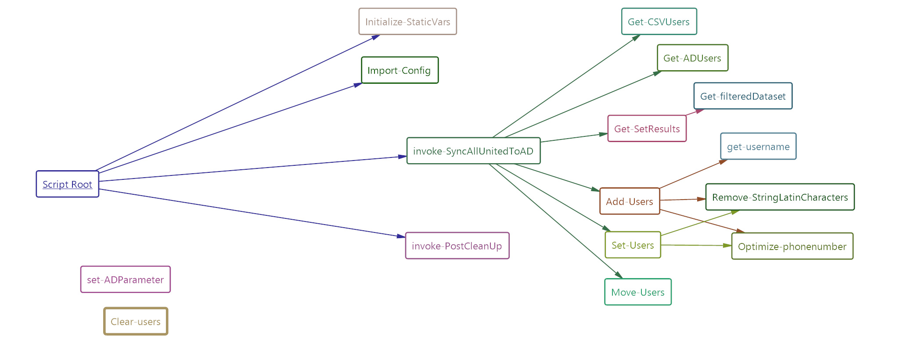

# AllUnitedToAD
Powershell script to convert export from membership administration to Active Directory

<Hr>

```
 AUTHOR  : Martijn Koetsier

 Based on: Marius / Hican - http://www.hican.nl - @hicannl (26-04-2012 --> 07-08-2014)

 DATE    : 2022-12-04
 COMMENT : This script creates new Active Directory users,
           including different kind of properties, based
           on an .csv-file.
 VERSION : 1.2.1
```

# Changelog

| Version | Date | Changes |
| :-- | :-- | :-- |
| 0.9 | 2019-03-17 | Copied code |
| 0.9.1 | 2019-04-06 | Removed attributes not used |
| 0.9.2 | 2019-04-13 | Create username and set functions |
| 0.9.3 | 2019-04-20 | Included Simulation argument |
| 0.9.4 | 2019-04-28 | working concept and user to contact idea worked out |
| 0.9.5 | 2019-06-16 | Move Home & profile and edit in user object when lid af |
| 0.9.6 | 2019-07-09 | Error with duplicate username loop. Fixed by initializing sam_ori. Fixed extra log in output folder |
| 1.0.0 | 2020-07-02 | Change primary key and optimized functions. Created backup |
| 1.0.1 | 2020-07-03 | Added additional info when change of fields is performed, added https://lazywinadmin.com/2015/05/powershell-remove-diacritics-accents.html method2 |
| 1.0.2 | 2020-07-03 | Fix for encoding. omit -Encoding --> UTF8, -Encoding Default --> do nothing https://stackoverflow.com/questions/48947151/import-csv-export-csv-with-german-umlauts-%C3%A4-%C3%B6-%C3%BC |
| 1.0.3 | 2020-07-17 | Added mailnickname for azure |
| 1.0.4 | 2020-07-28 | Fix for phone numbers |
| 1.0.5 | 2020-07-29 | Update fix for more numbers and debug |
| 1.0.5a | 2020-08-06 | Created generalized version for GitHub (not this one!) |
| 1.0.6 | 2020-09-08 | Validation of email fixed |
| 1.0.7 | 2020-09-23 | last check of contact creation for old members |
| 1.0.8	 | 2021-06-12 | keep input logs for longer time |
| 1.0.9	 | 2021-08-01 | Fix officephone for change-users set |
| &nbsp; | &nbsp; | &nbsp; |
| 1.0.10 | 2021-10-31 | Disable profilepath  |
| 1.0.10 | 2022-01-18 | Fix homedrive bug due to commented profilepath +  import with utf8 |
| 1.0.11 | 2022-02-10 | Exclude users without valid name2 |
| 1.0.12 | 2022-02-10 | Rename lid-af users to $samaccountname |
| 1.0.13 | 2022-07-29 | fix new header, line 203 |
| &nbsp; | &nbsp; | &nbsp; |
| 1.1.0 | 2021-10-01 | Rewrite / cleanup code, so Github and local are identical |
| 1.1.1 | 2021-10-04 | Add secondary email |
| &nbsp; | &nbsp; | &nbsp; |
| 1.2.0 | 2022-12-02 | Rewrite / cleanup |
| 1.2.1 | 2022-12-04 | Fix PSScriptAnalyzer Stuff |

# Requirements
- Domain Controller
  - Active Directory
  - Powershell
  - Domain Account
    - Account Operator rights (optional: Logon as batch script rights when using scheduled task)
    - Right to write in script folder (for logs, backups and input folder)
  - Share for input files (Please use FSRM with quota and screening)

- AllUnited as membership administration program

# Usage



## Fill variables in .env as JSON

```JSON
{
  "name": "VarName",
  "value": "VarValues as String",
  "option": "AllScope, Readonly",
  "scope": "Global",
  "description": "Some description"
}
```
Sync keys of CSV and AD are needed to find an unique account. This is performed using the `unique ID of AllUnited` which will be written to the attribute `employeeID`

```
name                   value
----                   -----
ADHeaderData           displayName,sn,initials,givenName,mail,telephoneNumber,description,sAMAccountName,EmployeeID,Employeenumber,ExtensionAttribute2
ChangeThreshold        0,25 (If a change of more than 25% is going to happen, the stop the script.)
ContactOU              OU=Contacts,dc=domain, dc=tld (Contacts are placed here)
DisabledOU             OU=Disabled accounts, dc=domain, dc=tld (Old users are placed here)
Enabled                true
Expires                true
CSVHeaderData          Some,Relevant,CSVHeader,Data,That,This,Script,Must,Use
HomeDirectory          \$dnsroot\DFS\Homes\
HomeDirectory_Direct   SomeLetter:\Homes
HomeDrive              SomeLetter
InactiveDays           365
LogRetentionDays       -30
PrimaryKeyAD           What AD Attribute should be the primary key (excluding system attributes like samAccountName)
PrimaryKeyCSV          What CSV Attribute should be the primary key
ProfilePath            \$dnsroot\dfs\Profiles\
ProfilePath_Direct     SomeLetter:\Profiles
TargetDefaultGroups    {CN=Group1,OU=Groups,dc=domain, dc=tld} (Group added and removed from users when created / removed/disabled)
TargetOU               OU=TargetOU,dc=domain, dc=tld  (New users are placed here)
IgnoreUsersDisplayName THIS_USER_MUST_BE_IGNORED
```

## Start script using start.bat:
- `powershell.exe -NoProfile -ExecutionPolicy bypass $PSScriptRoot\AllUnitedToAD\SyncAllUnitedAD.ps1 -simulation:\$false -interactive:\$false`